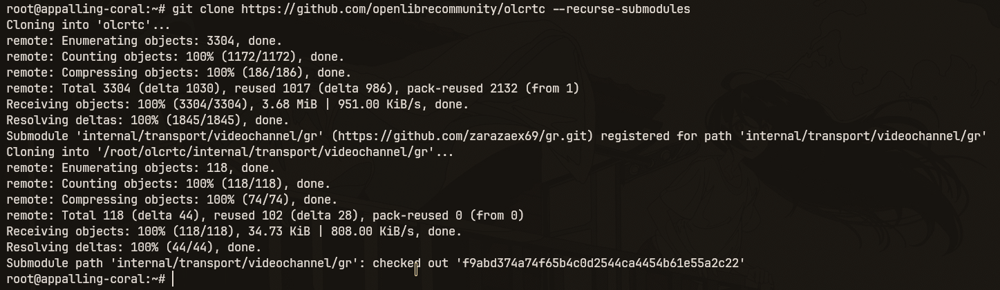

<div align="center">


**RU** / [EN](fast.md)

</div>

# Быстрый старт (через скрипты)

> **Важно:** Обязательно проверяйте, есть ли сервис видеозвонков у вас в белых списках, работает ли он в вашей сети и так далее. Если нет - используйте другой.

Это самый простой способ. Всё запускается в контейнере [Podman](https://ru.wikipedia.org/wiki/Podman). Скрипт делает всё сам: клонирует [исходники](https://github.com/openlibrecommunity/olcrtc), собирает бинарник в контейнере, генерирует конфиг и запускает.

Проект в бете. По проблемам: t.me/openlibrecommunity

Хочешь собрать бинарник руками - смотри [manual.ru.md](manual.ru.md).

---

## Что нужно установить

### git

```sh
apt install git        # Debian / Ubuntu / Mint
pacman -S git          # Arch / CachyOS / Manjaro
dnf install git        # Fedora / RHEL / CentOS
```

### curl

```sh
apt install curl       # Debian / Ubuntu / Mint
pacman -S curl         # Arch / CachyOS / Manjaro
dnf install curl       # Fedora / RHEL / CentOS
```

### podman

Можно не ставить заранее - скрипт сам поставит podman, если его нет. Но при желании:

```sh
apt install podman     # Debian / Ubuntu / Mint
pacman -S podman       # Arch / CachyOS / Manjaro
dnf install podman     # Fedora / RHEL / CentOS
```

### swap (ОЗУ)

Если на машине меньше 4 ГБ оперативной памяти, сборка может вылетать. **Включите SWAP**:

```sh
sudo fallocate -l 4G /swapfile && sudo chmod 600 /swapfile && sudo mkswap /swapfile && sudo swapon /swapfile
```

---

## Шаг 1: Скачать репозиторий

```sh
git clone https://github.com/openlibrecommunity/olcrtc --recurse-submodules
cd olcrtc
```



---

## Шаг 2: Запустить сервер

На машине, через которую должен идти трафик (VPS, сервер за рубежом, домашний ПК):

```sh
./script/srv.sh
```

Скрипт сам поставит podman при необходимости, склонирует актуальный код, соберёт бинарник в контейнере и запустит сервер. Дальше он задаст вопросы.

#### Флаги `srv.sh`

| Флаг | Что делает |
|---|---|
| `--branch=<name>` | Использовать другую ветку репозитория вместо `master` |
| `--no-cache` | Очистить Go-кеш (`~/.cache/olcrtc`) перед сборкой - пересобрать с нуля |

```sh
./script/srv.sh --no-cache               # сборка с нуля
./script/srv.sh --branch=dev --no-cache  # ветка dev, без кеша
```

### Carrier (на каком сервисе передавать трафик)

```
Select carrier:
  1) jitsi
  2) telemost
  3) wbstream
Enter choice [1-3, default: 1]:
```

**По умолчанию `jitsi`** - стабильно работает на datachannel, не требует регистрации, легко поднимается на своём сервере. Полная матрица совместимости - в [settings.ru.md](settings.ru.md).

### Transport (как именно передавать данные)

```
Select transport:
  1) datachannel
  2) videochannel
  3) seichannel
  4) vp8channel
Enter choice [1-4, default: 1]:
```

Рекомендации:
- **datachannel** - самый быстрый, минимальный пинг. Стабильно работает с `jitsi`. **WBStream DC не работает** в обычном guest flow. **Telemost удалил DC**.
- **vp8channel** - работает с telemost и wbstream, быстрый, но большой пинг.
- **seichannel** - работает только с wbstream, медленный, но мелкий пинг.
- **videochannel** - работает с wbstream стабильно, с telemost по возможности; самый медленный и с большим пингом.

**Рекомендуемая комбинация: `jitsi + datachannel`**. Альтернатива: `wbstream + vp8channel`.

### Jitsi-сервер (только для carrier jitsi)

```
Введите URL Jitsi-комнаты (https://HOST/ROOM).
Выберите HOST из docs/examples/jitsi.instances.yaml и проверьте, что он открывается в браузере.
```

Выбери тот сервер, который **открывается в твоём браузере**. Подойдёт любой публичный или self-hosted Jitsi Meet.

### Room (только для carrier jitsi)

```
Room options:
  1) Auto-generate new room (recommended)
  2) Use specific room name or URL
Enter choice [1-2, default: 1]:
```

- **1) Auto-generate** - скрипт сам придумает имя комнаты на выбранном сервере. Рекомендуется.
- **2) Specific** - введи имя комнаты (`myroom`) или полный URL (`https://meet.example.org/myroom`).

Для **telemost** и **wbstream** Jitsi-меню не показывается - скрипт спросит Room ID напрямую. Создай руму через сайт ([telemost](https://telemost.yandex.ru/), [wbstream](https://stream.wb.ru)) и вставь её ID.

### DNS

```
DNS server [default: 8.8.8.8:53]:
```

Нажми Enter. Менять не нужно без причины; при желании - `77.88.8.8:53` или DNS твоего провайдера.

### SOCKS5-прокси для исходящего трафика

```
Use SOCKS5 proxy for egress? (y/N):
```

Если не нужно - просто Enter. Если сервер сам должен ходить через внешний прокси - введи `y` и укажи адрес и порт.

### Параметры транспорта (только videochannel)

```
Video codec:
  1) qrcode
  2) tile (requires 1080x1080)
Enter choice [1-2, default: 1]:
```

- **qrcode** - QR-коды, настраиваемое разрешение, стабильный, медленный.
- **tile** - тайловый кодек, только 1080x1080, поддержка Reed-Solomon, быстрее, но менее стабилен.

Дальше скрипт спросит ширину/высоту, коррекцию ошибок QR, размер фрагмента (или параметры tile), FPS, битрейт и аппаратное ускорение (`none`/`nvenc`). Для значений по умолчанию жми Enter.

### Параметры транспорта (только vp8channel)

```
VP8 FPS [default: 25]:
VP8 batch size (frames per tick) [default: 1]:
```

Жми Enter, если устраивают `25` и `1`.

### Параметры транспорта (только seichannel)

```
SEI FPS [default: 60]:
SEI batch size (frames per tick) [default: 64]:
SEI fragment size in bytes [default: 900]:
SEI ACK timeout in milliseconds [default: 2000]:
```

Жми Enter на всех - значения по умолчанию оптимальны.

### Комментарий к конфигу

```
Enter a comment for the config (default: olc - t.me/openlibrecommunity):
```

Это подпись для итогового `olcrtc://` URI. Можно оставить пустым (Enter).

### Результат

После запуска скрипт выведет имя контейнера, carrier, transport, Room ID, **ключ шифрования** и готовый `olcrtc://` URI:

```
[+] Server started successfully!

Container name: olcrtc-server-xxxxxxxx
Carrier:        jitsi
Transport:      datachannel
Room ID/URL:    https://meet.example.org/olcrtc-xxxxxxxx
Encryption key: d823fa01cb3e0609b67322f7cf984c4ee2e294936fc24ef38c9e59f4799...

uri: olcrtc://jitsi?datachannel@https://meet.example.org/olcrtc-xxxxxxxx#<key>$olc - t.me/openlibrecommunity
```

**Сохрани Room ID и ключ шифрования** - они нужны для клиента. Ключ также сохраняется в `~/.olcrtc_key` и переиспользуется при повторных запусках.

---

## Шаг 3: Запустить клиент

На своей машине (домашний ПК, ноутбук):

> Хочешь готовый Android-клиент? Возьми [owenewans/owenclave](https://github.com/owenewans/owenclave) ([src.owenewans.org/owenrtc](https://src.owenewans.org/owenrtc)) - он читает URI `olcrtc://` и подписки напрямую, без бинарника. Ниже - запуск нативного бинарника `cnc` (только SOCKS5).

```sh
git clone https://github.com/openlibrecommunity/olcrtc --recurse-submodules
cd olcrtc
./script/cnc.sh
```

Отвечай на те же вопросы, что и на сервере - **auth, transport и room ID должны совпадать**. Для jitsi скрипт спросит тот же выбор сервера и имя/URL комнаты.

Когда спросит ключ:

```
Enter Encryption Key (hex):
```

Вставь ключ с сервера (64 hex-символа).

### SOCKS5: адрес, порт, аутентификация

```
SOCKS5 ip [default: 127.0.0.1]:
SOCKS5 port [default: 8808]:
SOCKS5 username (leave empty to disable auth):
```

Жми Enter для адреса и порта - прокси поднимется на `127.0.0.1:8808`. Если нужна защита логином/паролем - введи логин, затем пароль. При биндинге вне loopback (не `127.*`) логин и пароль обязательны.

### Результат

```
[+] Client started successfully!

Container name: olcrtc-client-xxxxxxxx
Auth:           jitsi
Transport:      datachannel
Room ID/URL:    https://meet.example.org/olcrtc-xxxxxxxx
SOCKS5 proxy:   127.0.0.1:8808
```

---

## Шаг 4: Проверить

```sh
curl --socks5-hostname 127.0.0.1:8808 https://icanhazip.com
```

Должен вернуться IP твоего сервера.

Или направить весь трафик через прокси:

```sh
export all_proxy=socks5h://127.0.0.1:8808
curl https://icanhazip.com
```

---

## Управление

### Логи

```sh
podman ps --filter name=olcrtc
podman logs -f olcrtc-server-xxxxxxxx   # на сервере
podman logs -f olcrtc-client-xxxxxxxx   # на клиенте
```

### Остановить

```sh
podman stop olcrtc-server-xxxxxxxx
podman stop olcrtc-client-xxxxxxxx
```

Остановить все olcrtc-контейнеры разом:

```sh
podman stop $(podman ps -q --filter name=olcrtc)
```

---

## Обновить уже запущенный инстанс

Запущенный контейнер сам не обновляется: внутри него остаётся бинарник, собранный на момент запуска. Чтобы перейти на актуальный код, останови старый контейнер и запусти скрипт заново.

```sh
cd olcrtc
git pull --recurse-submodules          # обновить локальные скрипты
podman stop olcrtc-server-xxxxxxxx     # остановить старый контейнер
./script/srv.sh --no-cache             # запустить заново со свежим кодом
```

`--no-cache` не обязателен, но гарантирует пересборку с нуля. При повторном запуске укажи те же `auth`, `transport`, `room ID` и ключ. Серверный ключ хранится в `~/.olcrtc_key` и переиспользуется автоматически.

---

## Несколько инстансов на одной машине

Можно запустить несколько серверов или клиентов на одной машине - каждый запуск создаёт контейнер с уникальным именем (`olcrtc-server-<random>`), они не конфликтуют.

```sh
./script/srv.sh   # первый инстанс - например jitsi + datachannel
./script/srv.sh   # второй инстанс - например wbstream + vp8channel
```

На клиенте для каждого инстанса запускай отдельный `cnc.sh` с **разными SOCKS5-портами**, чтобы переключаться между ними:

```sh
./script/cnc.sh   # первый клиент - порт 8808 (по умолчанию)
./script/cnc.sh   # второй клиент - укажи порт 8809
```

---

Все настройки и матрица совместимости: [settings.ru.md](settings.ru.md). Ручная сборка без скриптов: [manual.ru.md](manual.ru.md).
